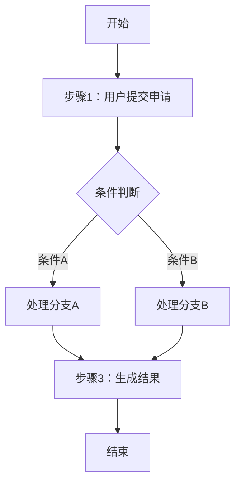
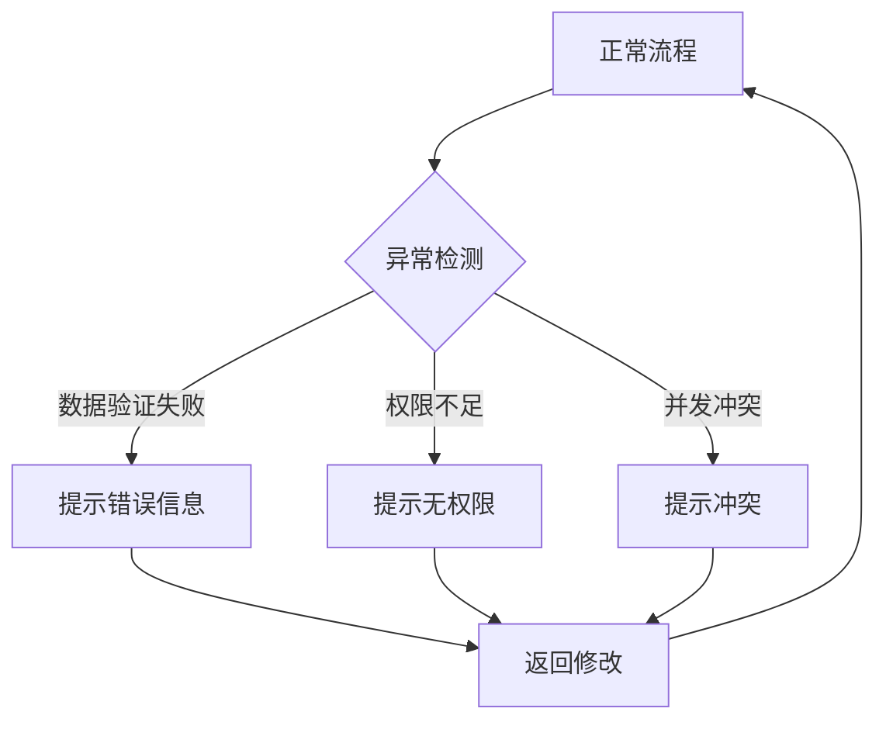
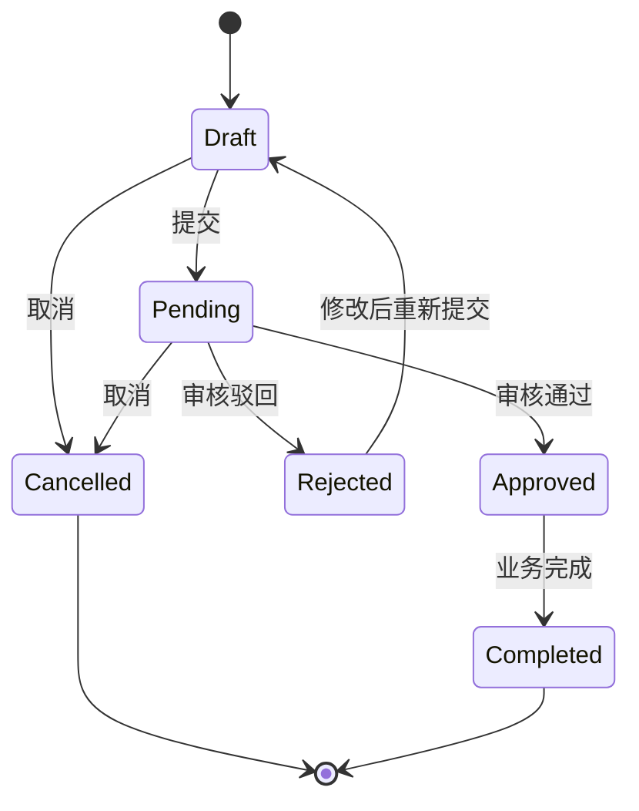

# 业务流程推演模板

> **文档类型**：业务流程推演  
> **业务场景**：[业务场景名称]  
> **创建日期**：YYYY-MM-DD  
> **分析人员**：[分析人员]

---

## 1. 业务背景

### 1.1 背景说明

[描述业务背景，说明为什么需要进行此流程推演]

### 1.2 推演目标

[描述推演的目标和预期产出]

### 1.3 涉及系统/模块

- [系统1/模块1]
- [系统2/模块2]

---

## 2. 业务流程图

### 2.1 主流程



### 2.2 异常流程



---

## 3. 关键节点说明

| 节点编号 | 节点名称 | 触发条件           | 处理逻辑       | 输出结果      | 异常处理           |
| -------- | -------- | ------------------ | -------------- | ------------- | ------------------ |
| N01      | 提交申请 | 用户点击提交       | 验证数据完整性 | 生成申请单号  | 数据不完整提示错误 |
| N02      | 审核     | 申请单状态为待审核 | 审核人审核     | 审核通过/驳回 | -                  |
| N03      | 生成结果 | 审核通过           | 创建业务单据   | 返回单据号    | 创建失败回滚       |

---

## 4. 数据推演

### 4.1 初始状态

**初始数据**：

```json
{
  "applicationId": null,
  "status": null,
  "applicant": "张三",
  "items": []
}
```

### 4.2 推演步骤

#### 步骤1：创建申请单

**操作**：用户创建申请单

**数据变化**：

```json
{
  "applicationId": "APP-20260131-001",
  "status": "Draft",
  "applicant": "张三",
  "items": [],
  "createdAt": "2026-01-31 10:00:00"
}
```

#### 步骤2：添加明细

**操作**：添加申请明细（SKU001, 数量100）

**数据变化**：

```json
{
  "applicationId": "APP-20260131-001",
  "status": "Draft",
  "applicant": "张三",
  "items": [
    {
      "sku": "SKU001",
      "quantity": 100,
      "applicantNote": "紧急需求"
    }
  ],
  "updatedAt": "2026-01-31 10:05:00"
}
```

#### 步骤3：提交申请

**操作**：用户点击提交

**数据变化**：

```json
{
  "applicationId": "APP-20260131-001",
  "status": "Pending", // Draft → Pending
  "applicant": "张三",
  "items": [...],
  "submittedAt": "2026-01-31 10:10:00"
}
```

#### 步骤4：审核通过

**操作**：审核人审核通过

**数据变化**：

```json
{
  "applicationId": "APP-20260131-001",
  "status": "Approved", // Pending → Approved
  "applicant": "张三",
  "approver": "李四",
  "approvedAt": "2026-01-31 11:00:00",
  "items": [...]
}
```

**关联影响**：

- 生成业务单据：`BIZ-20260131-001`
- 库存预留（如适用）

### 4.3 最终状态

**最终数据**：

```json
{
  "applicationId": "APP-20260131-001",
  "status": "Completed",
  "applicant": "张三",
  "approver": "李四",
  "relatedDocument": "BIZ-20260131-001",
  "items": [...],
  "completedAt": "2026-01-31 11:05:00"
}
```

---

## 5. 状态流转分析

### 5.1 状态流转图



### 5.2 状态说明

| 状态      | 说明   | 可执行操作       | 后续状态                      |
| --------- | ------ | ---------------- | ----------------------------- |
| Draft     | 草稿   | 编辑、提交、取消 | Pending, Cancelled            |
| Pending   | 待审核 | 审核、取消       | Approved, Rejected, Cancelled |
| Approved  | 已审核 | 生成单据         | Completed                     |
| Rejected  | 已驳回 | 修改后重新提交   | Draft                         |
| Completed | 已完成 | -                | -                             |
| Cancelled | 已取消 | -                | -                             |

---

## 6. 边界场景与异常处理

### 6.1 边界场景

#### 场景1：最小数据场景

**场景描述**：申请单明细为0

**处理规则**：

- 不允许提交
- 提示信息："至少添加一条明细"

#### 场景2：最大数据场景

**场景描述**：明细行数超过100行

**处理规则**：

- 不允许添加
- 提示信息："明细行数不能超过100行"

#### 场景3：边界值场景

**场景描述**：申请数量刚好等于库存可用量

**处理规则**：

- 允许提交
- 预留库存后库存可用量为0

### 6.2 异常场景

#### 异常1：数据验证失败

**触发条件**：必填项为空或数据格式错误

**处理逻辑**：

- 阻止提交
- 提示具体错误字段

**提示信息**："请填写必填项：[字段名]"

#### 异常2：并发冲突

**触发条件**：同一单据被多人同时编辑

**处理逻辑**：

- 后提交的操作失败
- 提示数据已被修改

**提示信息**："数据已被他人修改，请刷新后重试"

#### 异常3：依赖数据不存在

**触发条件**：关联的数据已被删除

**处理逻辑**：

- 阻止操作
- 提示关联数据不存在

**提示信息**："关联的[实体名称]不存在"

#### 异常4：权限不足

**触发条件**：用户无操作权限

**处理逻辑**：

- 阻止操作
- 提示无权限

**提示信息**："您没有权限执行此操作"

---

## 7. 影响范围分析

### 7.1 数据影响

| 影响对象   | 影响类型  | 影响说明               |
| ---------- | --------- | ---------------------- |
| 申请单表   | 新增/更新 | 创建或更新申请单据     |
| 业务单据表 | 新增      | 审核通过后生成业务单据 |
| 库存表     | 更新      | 预留库存数量           |
| 操作日志表 | 新增      | 记录每次操作           |

### 7.2 系统影响

| 影响系统 | 影响模块 | 影响说明                   |
| -------- | -------- | -------------------------- |
| 申请系统 | 申请管理 | 新增申请单创建和审核功能   |
| 业务系统 | 单据管理 | 接收申请系统生成的业务单据 |
| 库存系统 | 库存管理 | 处理库存预留               |

### 7.3 接口影响

| 接口名称                       | 影响类型 | 影响说明       |
| ------------------------------ | -------- | -------------- |
| POST /applications             | 新增     | 创建申请单接口 |
| PUT /applications/:id          | 新增     | 更新申请单接口 |
| POST /applications/:id/submit  | 新增     | 提交申请单接口 |
| POST /applications/:id/approve | 新增     | 审核接口       |

---

## 8. 关键业务规则

| 规则编号 | 规则描述                        | 适用场景        |
| -------- | ------------------------------- | --------------- |
| R01      | 申请单明细至少1行，最多100行    | 创建/编辑申请单 |
| R02      | 申请数量必须>0且≤库存可用量     | 添加明细        |
| R03      | 只有Draft状态的申请单可以编辑   | 编辑申请单      |
| R04      | 只有Pending状态的申请单可以审核 | 审核申请单      |
| R05      | 审核通过后自动生成业务单据      | 审核流程        |

---

## 9. 性能考虑

### 9.1 预期数据量

- 每日新增申请单：约1000单
- 单个申请单平均明细行数：10行
- 并发用户数：峰值50人

### 9.2 性能要求

- 申请单创建响应时间：<500ms
- 审核操作响应时间：<1s
- 列表查询响应时间：<2s

---

## 10. 结论与建议

### 10.1 结论

[总结业务流程推演的结论]

### 10.2 改进建议

- [建议1]
- [建议2]

### 10.3 待确认事项

- [ ] [待确认事项1]
- [ ] [待确认事项2]

---

## 附录

### A. 相关文档

- [PRD文档链接]
- [字段清单链接]
- [接口文档链接]

### B. 修订记录

| 版本 | 日期       | 修订内容 | 修订人 |
| ---- | ---------- | -------- | ------ |
| V1.0 | YYYY-MM-DD | 初始版本 | [姓名] |
