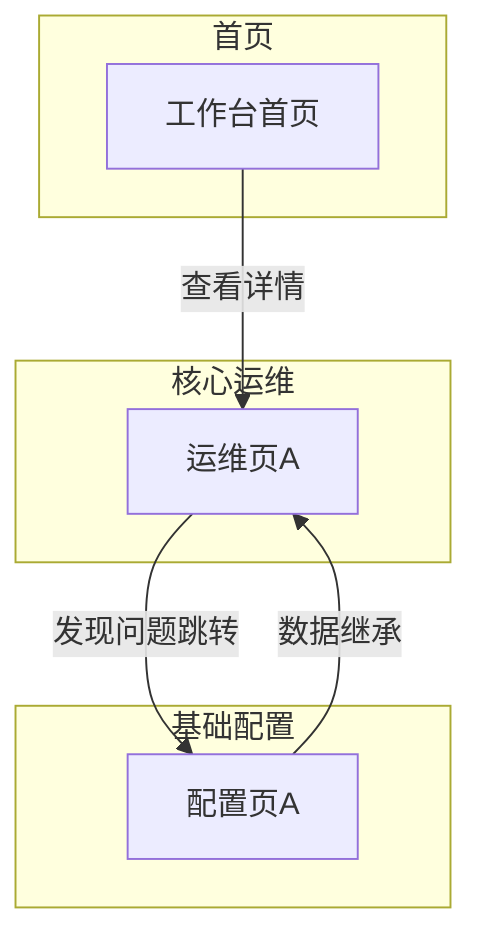

# B端产品需求文档（PRD）— 开发版模板

> 本模板适用于中大型模块（20+ 实体、50+ 功能），研发可据此直接开发。与 RDD（需求定义）和 Architecture（方案架构）配合使用——PRD 从页面/接口/规则角度组织，RDD 从业务流程角度组织，Architecture 从数据模型角度组织。

---

## 0. 文档基础信息

- 文档标题：{模块名称}
- 版本号：{v0.1 / v1.0}
- 状态：{草稿/评审中/已评审/冻结}
- 作者：{姓名}
- 评审人：{产品/研发/测试/业务代表}
- 计划里程碑：评审{日期} / 提测{日期} / 上线{日期}

### 0.1 变更记录

| 版本 | 变更日期 | 变更内容 | 变更人 |
|------|---------|---------|--------|
| v0.1 | YYYY-MM-DD | 初稿 | {姓名} |

### 0.2 关联链接

- RDD：{路径}
- Architecture：{路径}
- 需求背景：{路径}
- 原型：{路径}

### 0.3 评审记录（进入评审后补齐）

| 日期 | 参会人 | 主要问题/结论 | 待办 |
|------|--------|-------------|------|

---

## 1. 需求定义

### 1.1 背景与现状

[1-2 段描述 As-Is 流程和痛点，引用数据/案例]

### 1.2 目标与成功口径

- 目标：{一句话}
- 成功口径：{指标 + 数据来源 + 评估窗口}

### 1.3 范围与边界

- In Scope（本期 P0）：{列表}
- Out of Scope：{排除项 + 原因}

### 1.4 影响范围

- 影响角色：{角色列表}
- 依赖系统：{外部系统/模块列表}

---

## 2. 枚举字典 ★ 研发必读

> 所有枚举字段的键值对集中定义，研发以此为准。与 Architecture Schema 中的 TinyInt 值保持一致。

| 枚举名 | 值 | 常量名 | 中文 | 适用实体 |
|--------|----|--------|------|---------|
| TransportMode | 10 | SEA | 海运 | service_channel, service_combination |
| TransportMode | 20 | AIR | 空运 | service_channel, service_combination |
| ... | ... | ... | ... | ... |

---

## 3. 状态机 ★ 研发必读

> 每个有状态流转的实体单独一节，含状态图 + 触发操作 + 约束。

### 3.1 {实体名} 状态流转

```
[状态A] ──{操作1}──→ [状态B] ──{操作2}──→ [状态C]
  │                    │
  └──{操作3}──→ [状态D] (异常分支)
```

| 当前状态 | 操作 | 目标状态 | 触发角色 | 校验条件 |
|---------|------|---------|---------|---------|
| {状态A} | {操作} | {状态B} | {角色} | {条件} |

---

## 4. 功能清单与页面映射

| 模块 | 功能点 | 优先级 | 对应页面 | 页面类型 |
|------|--------|--------|---------|---------|
| {模块A} | {功能1} | P0 | {页面名} | 列表页/编辑页/工作台 |
| {模块A} | {功能2} | P0 | {页面名} | ... |

### 4.1 页面导航关系图 ★ 页面 ≥ 5 个时必画

> 当原型页面较多（≥ 5 个）时，画一张页面导航图，标注跳转关系、数据流向、角色入口。用 Mermaid flowchart，按菜单分组 subgraph。



> **必含元素**：每个原型页面对应一个节点、跳转箭头 + 触发条件标签、按菜单分组 subgraph。

---

## 5. 页面规格 ★ 研发必读

> 每个页面一个小节，含：页面路径、字段表（字段名/类型/必填/默认值/校验规则/数据来源）、交互行为、关联接口。

### 5.1 {页面名称}

**页面信息**：
- 路径：{菜单路径}
- 类型：列表页 / 编辑页 / 查询页 / 工作台
- 访问角色：{角色列表}

**字段表**：

| 字段名 | 中文名 | 类型 | 必填 | 默认值 | 校验规则 | 数据来源 | 备注 |
|--------|--------|------|------|--------|---------|---------|------|
| {field} | {中文} | {类型} | ✅/条件/— | {默认} | {规则} | {来源} | {备注} |

**交互行为**：
- [新增]：{触发条件 + 弹窗/跳转 + 表单字段}
- [编辑]：{触发条件 + 可编辑字段范围}
- [删除/禁用]：{触发条件 + 确认弹窗 + 级联影响}
- [按钮]：{按钮名：显示条件 + 点击行为}

**关联接口**：
- 查询：`GET /api/xxx` (params: {参数列表})
- 提交：`POST /api/xxx` (body: {字段列表})
- {其他接口}

---

## 6. 业务规则 ★ 研发必读

> 每条规则含：触发点、条件/公式、输出、异常处理。研发据此实现后端逻辑。

| 编号 | 触发点 | 条件/公式 | 输出 | 异常处理 |
|------|--------|----------|------|---------|
| R01 | {触发场景} | {条件表达式或公式} | {写入哪个字段/返回什么} | {失败时怎么做} |

---

## 7. 计算公式 ★ 研发必读

> 涉及金额计算的所有公式集中定义，含变量说明、精度要求、取整规则。

### 7.1 {计算名称}

```
变量定义:
  {变量名} = {含义}（来源：{表.字段}）

公式:
  {结果} = {表达式}

精度: {小数位数 + 取整规则}
条件分支: {不同条件下的公式变体}
```

---

## 8. 权限矩阵

| 操作 | 角色A | 角色B | 角色C |
|------|-------|-------|-------|
| {页面/功能} | ✅/仅查看/❌ | ... | ... |

---

## 9. 接口清单

| 接口 | 方法 | 路径 | 触发页面 | 请求参数 | 返回字段 | 失败处理 |
|------|------|------|---------|---------|---------|---------|
| {接口名} | GET/POST | /api/xxx | {页面} | {参数} | {返回} | {处理} |

---

## 10. 错误提示文案汇总

> 所有面向用户的错误/提示文案集中管理，研发直接引用，避免散落各处导致文案不一致。

| 编号 | 触发条件 | 文案 | 类型（阻断/警告/提示） |
|------|---------|------|----------------------|
| E01 | {条件} | "{文案}" | 阻断 |
| E02 | {条件} | "{文案}" | 警告 |

---

## 11. 验收标准

| 编号 | 验收项 | 验收方式 | 通过标准 | 关联 AC |
|------|--------|---------|---------|---------|
| A01 | {验收项} | {手动/自动化} | {标准} | AC0a |

---

## 12. 附录

- 术语表：{术语-解释}
- 原型链接：{URL}
- RDD（完整业务流程+字段表）：{路径}
- Architecture（完整 Schema+ER 图）：{路径}
