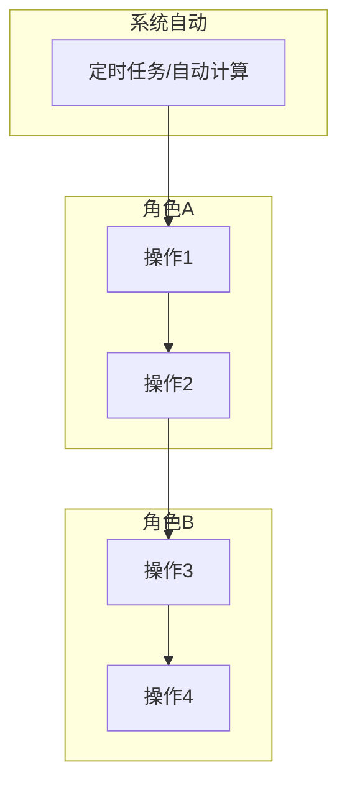
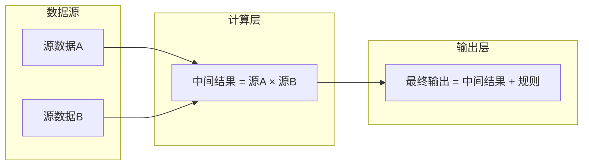
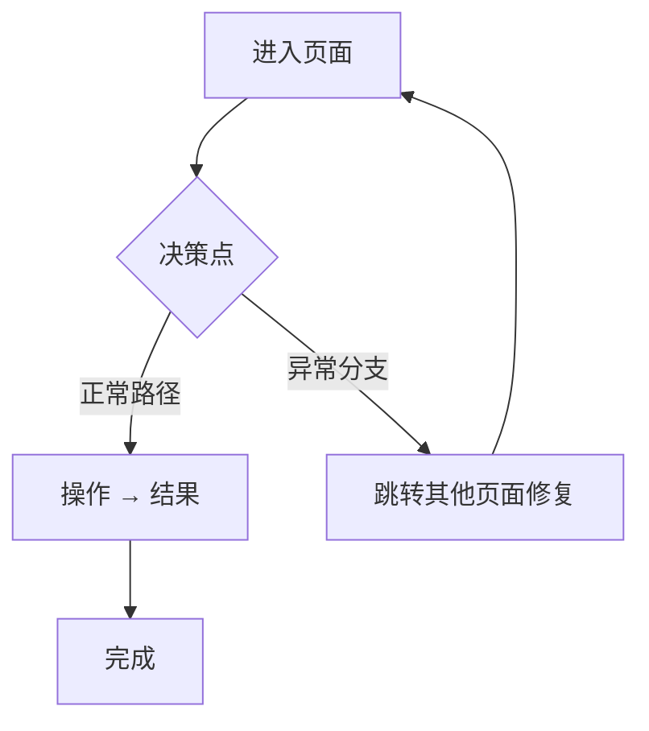

# 需求定义卡片 (RDD) — [模块名称]

> **原始需求**：[一句话描述为什么做这个模块]
>
> **文档版本**: v1.0 | **日期**: YYYY-MM-DD | **作者**: [作者]

***

## 1. 核心洞察 (Insight)

### 真实痛点

[2-3 段描述当前业务流程中的具体痛点。回答三个问题：现在怎么做？哪里痛？痛到什么程度？]

### JTBD（待办任务）

> **[角色]** 雇佣"[模块]"不是为了"[表面功能]"，而是为了：**当[触发场景]时，能在[时间目标]内完成[核心任务]，且[质量要求]。**

> **[角色]** 雇佣"[模块]"不是为了"[表面功能]"，而是为了：**[场景]时，[时间]内[做什么]，不用[当前替代方案]。**

### 业务价值：**[HIGH / MEDIUM / LOW]**

| 维度 | 当前 | 目标 |
|------|------|------|
| [指标1] | [现状] | [目标] |
| [指标2] | [现状] | [目标] |

***

## 2. 业务全景图

> **目的**：给读者一张地图，在深入细节前先建立全局认知。

### 2.1 角色与工作节奏

| 角色 | 核心任务 | 频率 |
|------|---------|------|
| [角色1] | [核心任务描述] | [日频/周频/按需] |
| [角色2] | [核心任务描述] | [频率] |

### 2.2 端到端业务链路

```
[用 ASCII 图展示从配置→运维→查询→治理的完整链路，每条链路标注对应的流程编号]

【一次性配置】
  XX → XX → XX
      ↓
【按需配置】
  XX → XX → XX
      ↓
【高频运维】
  XX → XX → XX
      ↓
【查询使用】
  XX → XX → XX
      ↓
【持续治理】
  XX → XX
```

### 2.3 实体依赖关系

```
[用缩进树形结构展示核心实体及关系，标注 1:1 / 1:N / N:N]

聚合根
  ├── 1:1 子实体A
  ├── 1:N 子实体B
  ├── 1:N 子实体C → 关联实体
  └── N:N 关联实体 ← 外部引用
```

### 2.4 核心业务流程图（泳道图）★ 必画

> 以核心角色的视角，覆盖从触发事件到完成交付的完整链路。如有周期性运维节奏（如周频），以一次完整周期为例。用 Mermaid flowchart 表达，按角色分组 subgraph。



> **必含元素**：触发事件、角色泳道、关键数据传递标注（如汇率、标准等跨流程共享数据）。

### 2.5 核心数据流图 ★ 有复杂计算链路时必画

> 当模块涉及"原始数据 → 多层计算 → 最终输出"的链路时，用 Mermaid flowchart 画出每层的数据来源、计算因子、输出目标。标注追溯路径。



> **示例**：超级运价模块的"成本→定价数据流"覆盖了 原始单价×汇率÷标准 → cost_per_kg → 头程合计 → +派送MAX → 成本底价 → +利润 → 公布价 → +优惠 → 最终报价 的完整链路。具体模块参照此模式绘制。

> 以下按 **N 条业务流程** 组织，每条流程包含：流程概述 → 实体字段定义 → 业务规则 → 核心场景 → 相关 AC。

***

## 3. 流程一：[流程名称]（[频率标签]）

> **触发**：[什么情况下启动此流程]
> **频率**：[一次性配置 / 周频 / 日频 / 按需]
> **前置依赖**：[依赖哪些外部数据或前置流程]

### 3.1 [实体名称] (EntityName)

[1-2 句描述此实体在流程中的定位]

> **As a** [角色]
> **I want to** [做什么]
> **So that** [业务目的]

| 字段 | 类型 | 必填 | 说明 |
|------|------|------|------|
| [字段名] | [文本/单选/多选/Integer/Decimal/DateTime/Enum/...] | ✅ / — | [说明] |

**业务规则**：[关键业务约束、校验逻辑]

**相关 AC**：`AC0a` `AC0b`

---

### 3.2 [下一个实体] (EntityName)

[重复以上结构。一条流程可包含多个相关实体]

---

### 3.N 核心场景（可选）

[当流程中多个实体之间存在联动场景时，在此处用 ASCII 图或步骤描述展示]

```
场景：XXX
  1. 操作 → 结果
  2. 操作 → 结果
```

**相关 AC**：[汇总此流程涉及的所有 AC]

---

## 4. 流程二：[流程名称]

[重复流程结构]

---

## N. 验收标准总览 (AC)

> 按流程分组，每条 AC 格式：`AC[N]-[简称]：[可测试的完整验收条件]`

### 流程一：[流程名称]

- [ ] **AC0a-[简称]**：[验收条件]
- [ ] **AC0b-[简称]**：[验收条件]

### 流程二：[流程名称]

- [ ] **AC[N]-[简称]**：[验收条件]

---

### 流程X.N 关键操作流程图 ★ 页面决策逻辑复杂时画

> **触发条件**：页面内存在非平凡决策分支（如异常→跳转修复→返回）、或多路径操作链路。简单 CRUD 页面不需要。
>
> 画出操作决策流程，覆盖正常路径 + 异常分支 + 跨页面跳转。



> **必含元素**：入口条件、决策节点（菱形）、内联操作（矩形）、跨页面跳转（标注目标页）、终止状态。

---

## N+1. NFR（非功能性需求）

- **性能**：[关键接口响应时间]
- **并发**：[同时操作用户数]
- **数据保留**：[关键数据保留年限]
- **精度**：[金额/重量/尺寸精度]
- **安全**：[权限控制要求]

---

## N+2. 计算示例：[示例名称]（如有）

以一组真实参数贯穿完整链路，分步展示每一步的输入、计算过程和输出，并标注每步属于哪条流程：

```
输入: {参数}

Step 1 [流程X] — [步骤名]:
          [中间计算]
          → [中间结果]

Step N [流程Y] — 最终:
          最终结果 = [结果]

多渠道对比:
  [表格]
```

---

## N+3. 功能清单

> 基于 N 条业务流程，共 **X 个模块、Y 项功能**。P0 = MVP，P1 = 二期，P2 = 三期。

### 模块 A：[模块名称]

| 编号 | 功能 | 优先级 | AC |
|------|------|--------|-----|
| A1 | [功能描述] | P0 / P1 / P2 | AC[N] |

### 分期汇总

| 分期 | 模块范围 | 功能数 |
|------|----------|--------|
| **Phase 1 (MVP)** | [模块列表] | **N** |
| **Phase 2** | [新增功能] | +N |
| **Phase 3** | [新增功能] | +N |

---

## N+4. MVP 方案与建议

### MVP 方案（Phase 1 — [一句话定位]）

```
运营端 [模块名称]
├── [子系统1]（[频率]）
│   ├── [功能]
│   └── [功能]
├── [子系统2]
│   └── [功能]
└── 审计 & 导入
    ├── 操作审计日志
    └── Excel 批量导入
```

**MVP 明确不做**：
- [不做的事项]（[原因/归属]）

### 理想方案（Phase 2-3）

- **Phase 2**：[核心新增]
- **Phase 3**：[核心新增]

### 专家建议

[建议内容]

---

## 下一步

[当前状态 + 下一步行动]
